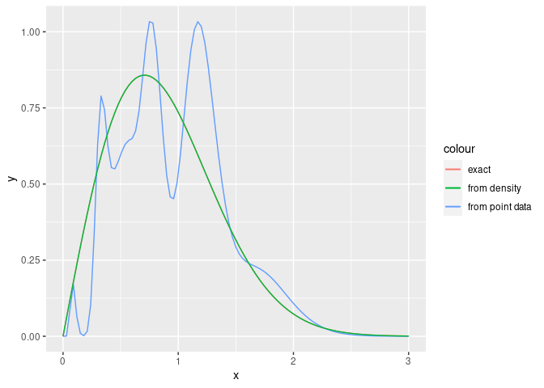

<!-- README.md is generated from README.Rmd. Please edit that file -->

# mapfit

<!-- badges: start -->
<!-- badges: end -->

The goal of mapfit is to estimate parameters of phase-type distribution
(PH) and Markovian arrival process (MAP). PH/MAP fitting is required in
the analysis of non-Markovian models involving general distributions. By
replacing general distributions with estimated PH/MAP, we have
approximate the non-Markovian models with continuous-time Markov chains
(CTMCs). Our tool offers

-   PH/MAP fitting with grouped data
-   PH fitting with theoretical probability density functions.

These features help us to analyze non-Markovian models with phase
expansion.

## Installation

``` r
# Install devtools from CRAN
install.packages("mapfit")

# Or the development version from GitHub:
# install.packages("devtools")
devtools::install_github("okamumu/mapfit")
```

## PH Fitting

### Overview

PH distribution is defined as the time to absorption in a
time-homogeneous CTMC with an absorbing state. The p.d.f. and cumulative
distribution function (c.d.f.) are mathematically given as the
expressions using matrix exponential. Let

and

denote a probability (row) vector for determining an initial state and
an infinitesimal generator for transient states, respectively. Since the
c.d.f. is given by the probability that the current state of underlying
CTMC has already been absorbed, the c.d.f. of PH distribution is given
by

 = 1 - \boldsymbol{\alpha} \exp(\boldsymbol{Q} x) \boldsymbol{1},
")

where

is a column vector whose entries are 1. Also the p.d.f. can be obtained
by taking the first derivative of the c.d.f.;

 = \boldsymbol{\alpha} \exp(\boldsymbol{Q} x) \boldsymbol{\xi},
")

where
.

The purpose of PH fitting is to determine PH parameters

and

so that the estimated PH distribution fits to observed data. There are
two different approaches; MM (moment match) method and MLE (maximum
likelihood estimation). The MM method is to find PH parameters whose
first few moments match to the moments from empirical data or
distribution functions. On the other hand, MLE is to find PH parameters
maximizing the likelihood (probability) of which the data is drawn from
the model as a sample.

### Data for PH fitting

The parameter estimation algorithm generally depends on data forms to be
used. mapfit deals with several kinds of data in PH fitting; point data,
weighted point data, grouped data, grouped data with missing values and
truncated data. The point data consists of independent and
identically-distributed (IID) random samples.

| Sample No. | Time |
|:----------:|:----:|
|     1      | 10.0 |
|     2      | 1.4  |
|     …      |  …   |
|    100     | 51.0 |

The above table shows an example of point data for a hundred IID
samples. The weighted point data is the point data in which all points
have their own weights. The weighted point data is used for numerical
integration of a density function in our tool. The grouped data consists
of break points and counts. For each of two successive break points, the
number of samples is counted as a bin. This is equivalent to the data
format to draw a histogram.

The grouped data with missing values allows us to use the grouped data
in which several counts are unknown (missing). In the tool, missing
counts are expressed by `NA`. Also, in the truncated data, several
samples are truncated at a point before their observations (right
censored data). The truncated data can be represented as the number of
samples in a specific interval from the point to infinity in the context
of grouped data.

| Time interval | Counts |
|:-------------:|:------:|
|   \[0, 10\]   |   1    |
|  \[10, 20\]   |  `NA`  |
|  \[20, 30\]   |   4    |
|  \[30, 40\]   |   10   |
|  \[40, 50\]   |  `NA`  |
|  \[50, 60\]   |   30   |
|  \[60, 70\]   |   10   |
|  \[70, 80\]   |   12   |
|  \[80, 90\]   |   4    |
|  \[90, 100\]  |   0    |
|  \[100, Inf)  |   5    |

The above table shows an example of the grouped data on break points 0,
10, 20, …, 100 where the data has missing values at the intervals
\[10,20\] and \[40,50\]. Furthermore, the last 5 samples are truncated
at 100.

| Time interval | Counts |
|:-------------:|:------:|
|   \[0, 10\]   |   1    |
|  \[10, 20\]   |  `NA`  |
|  \[20, 30\]   |   4    |
|  \[30, 40\]   |   10   |
|  \[40, 50\]   |  `NA`  |
|  \[50, 60\]   |   30   |
|  \[60, 70\]   |   10   |
|  \[70, 80\]   |   12   |
|  \[80, 90\]   |   4    |
|  \[90, 100\]  |   0    |
|  \[100, Inf)  |  `NA`  |

On the other hand, the aboe table shows an example of another grouped
data. In this case, several samples are truncated at 100 but we do not
know the exact number of truncated samples.

### Models and Methods

PH distributions are classified to sub-classes by the structure of

and
,
and the parameter estimation algorithms depend on the class of PH
distribution. The tool deals with the following classes of PH
distribution:

-   general PH: The PH distribution in which there are no constraints on
    
    and
    .
    In the tool, this is referred to as \`ph’ class.
-   canonical form 1 (CF1): One of the minimal representations of
    acyclic PH distribution. The matrix
    
    becomes a bidiagonal matrix whose entries are sorted in increasing
    order. In the tool, this is referred to as \`cf1’ class.
-   hyper-Erlang distribution: One of the representations of acyclic PH
    distribution. The distribution consists of a mixture of Erlang
    distributions. In the tool, this is referred to as \`herlang’ class.

The parameters of `ph` class are
,

and
,
which are defined as members, called *slots*, of S4 class in R. To
represent the matrix
,
we use `Matrix` package which is an external package of R. The slots of
`cf1` class are inherited from the `ph` class. In addition to inherited
slots, `cf1` has a slot `rate` to store the absolute values of diagonal
elements of
.
The `herlang` class has the slots for the mixed ratio, shape parameters
of Erlang components, rate parameters of Erlang components. Both of
`cf1` and `herlang` classes can be transformed to `ph` class by using
\`as’ method of R.

The R functions for PH parameter estimation are;

-   `phfit.point`: MLEs for general PH, CF1 and hyper-Erlang
    distribution from point and weighted point data. The estimation
    algorithms for general PH and CF1 are the EM algorithms proposed in
    \[1\]. The algorithm for hyper-Erlang distribution is the EM
    algorithm with shape parameter selection described in \[2,3\].
-   `phfit.group`: MLEs for general PH, CF1 and hyper-Erlang
    distribution from grouped and truncated data. The estimation
    algorithms for general PH and CF1 are the EM algorithms proposed in
    \[4\]. The algorithm for hyper-Erlang distribution is the EM
    algorithm with shape parameter selection, which is originally
    developed as an extension of \[2,3\].
-   `phfit.density`: MLEs for general PH, CF1 and hyper-Erlang
    distribution from a density function defined on the positive domain
    \[0, Inf). The function `phfit.density` calls `phfit.point` after
    making weighted point data. The weighted point data is generated by
    numerical quadrature. In the tool, the numerical quadrature is
    performed with a double exponential (DE) formula.
-   `phfit.3mom`: MM methods for acyclic PH distribution with the first
    three moments \[5,6\].

The functions `phfit.point`, `phfit.group` and `phfit.density` select an
appropriate algorithm depending on the class of a given PH distribution.
These functions return a list including the estimated model (`ph`, `cf1`
or `herlang`), the maximum log-likelihood (llf), Akaike information
criterion (aic) and other statistics of the estimation algorithm. Also,
the function `phfit.3mom` returns a `ph` class whose first three moments
match to the given three moments.

### Example

Here we introduce examples of the usage of PH fitting based on IID
samples from Weibull distribution. At first, we load the mapfit package
and generate IID samples from a Weibull distribution:

``` r
library(mapfit)

RNGkind(kind = "Mersenne-Twister")
set.seed(1234)
wsample <- rweibull(100, shape=2, scale=1)
```

`wsample` is set to a vector including a hundred IID samples generated
from Weibull distribution with scale parameter 1 and shape parameter 2.
`set.seed(1234)` means determing the seed of random numbers.

``` r
wsample
#>   [1] 1.47450394 0.68871906 0.70390766 0.68745901 0.38698715 0.66768398
#>   [7] 2.15798755 1.20774494 0.63744792 0.81550201 0.60487388 0.77911210
#>  [13] 1.12394405 0.28223484 1.10901777 0.42140013 1.11847354 1.14942511
#>  [19] 1.29542664 1.20832306 1.07241633 1.09317655 1.35593576 1.79415102
#>  [25] 1.23272029 0.45823831 0.80189104 0.29867185 0.42977942 1.75616647
#>  [31] 0.88603717 1.15209430 1.09019210 0.82379560 1.30718279 0.52428076
#>  [37] 1.26618210 1.16260990 0.08877248 0.46259605 0.76928163 0.66055079
#>  [43] 1.07949774 0.68927927 1.05326127 0.83015673 0.62445527 0.85066119
#>  [49] 1.18780419 0.51698994 1.61451826 1.08267929 0.57645512 0.82710123
#>  [55] 1.37015479 0.82783512 0.83982074 0.53486736 1.32097400 0.40547750
#>  [61] 0.38107465 1.78142911 1.07157783 2.07043978 1.19632106 0.58944015
#>  [67] 1.08505663 0.82231170 1.72143270 0.75610263 1.45189672 0.33667780
#>  [73] 2.05544853 0.49443698 1.55189411 0.80962054 0.97796650 1.63049390
#>  [79] 1.06650011 0.63460678 0.27649350 0.86658386 1.39556590 0.77994249
#>  [85] 1.27622488 0.32701528 0.97102624 1.08091533 1.35366256 0.33107018
#>  [91] 1.33917815 0.32386549 1.41750912 1.42403682 1.50035348 0.81868450
#>  [97] 1.09695465 1.90327589 1.08273771 0.54611792
```

Based on the point data, we can estimate PH parameters. Here we obtain
the estimated parameters for general PH with 5 states, CF1 with 5 states
and the hyper-Erlang with 5 states by the following commands,
respectively;

``` r
## phfit with GPH
phfit.point(ph=ph(5), x=wsample)
#> 
#> Maximum LLF: -59.436973
#> AIC: 176.873945
#> Iteration:  2000 / 2000
#> Computation time (user): 0.924000
#> Convergence: FALSE
#> Error (abs): 2.658070e-05 (tolerance Inf)
#> Error (rel): 4.472080e-07 (tolerance 1.490116e-08)
#> 
#> Size : 5
#> Initial :  8.354082e-11 0.9958273 0.0006050049 0.003567682 9.063406e-95 
#> Exit    :  0.1179994 3.90902e-93 6.464486e-06 0.05132675 4.831416 
#> Infinitesimal generator : 
#> 5 x 5 sparse Matrix of class "dgCMatrix"
#>                                                                           
#> [1,] -4.871469e+00  4.471403e-144   1.628003e-66  5.694646e-18  4.75347004
#> [2,]  6.303324e-02  -4.830687e+00   4.592402e+00  8.763450e-03  0.16648792
#> [3,]  1.236227e-04   9.657331e-18  -4.850744e+00  4.816559e+00  0.03405511
#> [4,]  4.455606e+00   3.099458e-66   8.686727e-21 -4.846059e+00  0.33912532
#> [5,]  4.366386e-15  3.315274e-225  3.603132e-124  9.071887e-51 -4.83141618

## phfit with CF1
phfit.point(ph=cf1(5), x=wsample)
#> Initializing CF1 ...
#> oxxxxx
#> xxxxxx
#> xxxxxx
#> xxxxxx
#> xxxxxx
#> xxxxxx
#> 
#> Maximum LLF: -59.416064
#> AIC: 136.832128
#> Iteration:  2000 / 2000
#> Computation time (user): 1.111000
#> Convergence: FALSE
#> Error (abs): 1.509990e-06 (tolerance Inf)
#> Error (rel): 2.541383e-08 (tolerance 1.490116e-08)
#> 
#> Size : 5
#> Initial :  0.8888552 0.003273583 0.08345855 0.02441269 1.479869e-101 
#> Rate    :  4.83095 4.83097 4.880507 4.88051 4.880513

## phfit with Hyper-Erlang
phfit.point(ph=herlang(5), x=wsample, ubound=3)
#> shape:  1 1 3  llf=-62.78
#> shape:  1 2 2  llf=-71.80
#> shape:  1 4  llf=-60.08
#> shape:  2 3  llf=-62.78
#> shape:  5  llf=-61.37
#> 
#> Maximum LLF: -60.083945
#> AIC: 128.167889
#> Iteration:  204 / 2000
#> Computation time (user): 0.034000
#> Convergence: TRUE
#> Error (abs): 8.852490e-07 (tolerance Inf)
#> Error (rel): 1.473354e-08 (tolerance 1.490116e-08)
#> 
#> Size : 2
#> Shape   :  1 4 
#> Initial :  0.01005939 0.9899406 
#> Rate    :  3.799481 4.058378
```

In the above example, the number of Erlang components is restructured to
3 or less by using `ubound` argument (see \[2\] in detail).

Also we present PH fitting with grouped data. In this example, we make
grouped data from the point data `wsample` by using the function `hist`
which is originally a function to draw a histogram.

``` r
h.res <- hist(wsample, breaks="fd", plot=FALSE)

h.res$breaks
#>  [1] 0.0 0.2 0.4 0.6 0.8 1.0 1.2 1.4 1.6 1.8 2.0 2.2

h.res$counts
#>  [1]  1  9 12 14 15 20 13  6  6  1  3
```

In the above, breaks are determined according to Freedman-Diaconis (FD)
rule. Then we can get estimated PH parameters from grouped data.

``` r
## phfit with GPH
phfit.group(ph=ph(5), counts=h.res$counts, breaks=h.res$breaks)
#> 
#> Maximum LLF: -22.812530
#> AIC: 103.625059
#> Iteration:  1647 / 2000
#> Computation time (user): 0.514000
#> Convergence: TRUE
#> Error (abs): 3.396318e-07 (tolerance Inf)
#> Error (rel): 1.488795e-08 (tolerance 1.490116e-08)
#> 
#> Size : 5
#> Initial :  8.191206e-08 1.395077e-64 0.9998728 0.0001250616 2.092792e-06 
#> Exit    :  8.185605e-06 4.88599 1.973519e-65 1.476447e-07 0.0001568522 
#> Infinitesimal generator : 
#> 5 x 5 sparse Matrix of class "dgCMatrix"
#>                                                                             
#> [1,]  -4.716760e+00  1.283349e-01   1.569076e-19  9.129134e-05  4.588326e+00
#> [2,]  8.528916e-123 -4.885990e+00  4.786686e-205  1.550664e-20  7.924260e-58
#> [3,]   4.349205e+00  3.927403e-03  -4.886069e+00  5.329321e-01  5.000110e-06
#> [4,]   1.528398e-55  4.846790e+00  8.559353e-115 -4.846790e+00  8.307741e-17
#> [5,]   6.936069e-20  2.830921e-05   1.273236e-61  4.685313e+00 -4.685498e+00

## phfit with CF1
phfit.group(ph=cf1(5), counts=h.res$counts, breaks=h.res$breaks)
#> Initializing CF1 ...
#> oxxxxx
#> xxxxxx
#> xxxxxx
#> xxxxxx
#> xxxxxx
#> xxxxxx
#> 
#> Maximum LLF: -22.811905
#> AIC: 63.623811
#> Iteration:  1304 / 2000
#> Computation time (user): 0.565000
#> Convergence: TRUE
#> Error (abs): 3.388332e-07 (tolerance Inf)
#> Error (rel): 1.485335e-08 (tolerance 1.490116e-08)
#> 
#> Size : 5
#> Initial :  0.8667713 2.82726e-05 0.1323529 0.0008475288 9.382448e-58 
#> Rate    :  4.684116 4.684117 4.886013 4.886015 4.886017

## phfit with Hyper-Erlang
phfit.group(ph=herlang(5), counts=h.res$counts, breaks=h.res$breaks)
#> shape:  1 1 1 1 1  llf=-61.14
#> shape:  1 1 1 2  llf=-35.55
#> shape:  1 1 3  llf=-26.45
#> shape:  1 2 2  llf=-35.55
#> shape:  1 4  llf=-23.59
#> shape:  2 3  llf=-26.45
#> shape:  5  llf=-23.97
#> 
#> Maximum LLF: -23.588309
#> AIC: 55.176617
#> Iteration:  204 / 2000
#> Computation time (user): 0.043000
#> Convergence: TRUE
#> Error (abs): 3.463910e-07 (tolerance Inf)
#> Error (rel): 1.468486e-08 (tolerance 1.490116e-08)
#> 
#> Size : 2
#> Shape   :  1 4 
#> Initial :  0.002267234 0.9977328 
#> Rate    :  3.186197 4.05926
```

Next we present the case where PH parameters are estimated from a
density function. The density function of Weibull distribution is given
by a function `dweibull`. Then we can also execute the following
commands;

``` r
## phfit with GPH
phfit.density(ph=ph(5), f=dweibull, shape=2, scale=1)
#> 
#> Maximum LLF: -11.251992
#> AIC: 80.503984
#> Iteration:  2000 / 2000
#> Computation time (user): 0.830000
#> Convergence: FALSE
#> Error (abs): 6.961001e-06 (tolerance Inf)
#> Error (rel): 6.186457e-07 (tolerance 1.490116e-08)
#> 
#> Size : 5
#> Initial :  4.577855e-49 0.01368209 0.9497458 0.03657207 8.584149e-09 
#> Exit    :  4.946403 0.0001532047 1.150315e-45 3.097348e-05 0.2731335 
#> Infinitesimal generator : 
#> 5 x 5 sparse Matrix of class "dgCMatrix"
#>                                                                         
#> [1,] -4.9464112  3.319514e-65  3.208540e-105  2.649815e-27  7.716337e-06
#> [2,]  0.2559562 -4.961494e+00   7.518925e-10  4.697923e+00  7.462019e-03
#> [3,]  0.5438509  4.116477e+00  -4.864664e+00  1.087195e-01  9.561702e-02
#> [4,]  0.1824197  2.980250e-13   2.459518e-32 -4.929520e+00  4.747069e+00
#> [5,]  4.7184058  1.030910e-42   9.896035e-77  2.082164e-14 -4.991539e+00

## phfit with CF1
phfit.density(ph=cf1(5), f=dweibull, shape=2, scale=1)
#> Initializing CF1 ...
#> oxxxxx
#> xxxxxx
#> xxxxxx
#> xxxxxx
#> xxxxxx
#> xxxxxx
#> 
#> Maximum LLF: -11.247614
#> AIC: 40.495228
#> Iteration:  2000 / 2000
#> Computation time (user): 1.031000
#> Convergence: FALSE
#> Error (abs): 2.792283e-07 (tolerance Inf)
#> Error (rel): 2.482556e-08 (tolerance 1.490116e-08)
#> 
#> Size : 5
#> Initial :  0.7536077 0.003014352 0.1516817 0.09169629 2.445755e-37 
#> Rate    :  4.844509 4.844531 5.062429 5.062435 5.06244

## phfit with Hyper-Erlang
phfit.density(ph=herlang(5), f=dweibull, shape=2, scale=1)
#> shape:  1 1 1 1 1  llf=-16.55
#> shape:  1 1 1 2  llf=-12.44
#> shape:  1 1 3  llf=-11.48
#> shape:  1 2 2  llf=-12.44
#> shape:  1 4  llf=-11.39
#> shape:  2 3  llf=-11.51
#> shape:  5  llf=-12.83
#> 
#> Maximum LLF: -11.391140
#> AIC: 30.782281
#> Iteration:  76 / 2000
#> Computation time (user): 0.043000
#> Convergence: TRUE
#> Error (abs): 1.461348e-07 (tolerance Inf)
#> Error (rel): 1.282881e-08 (tolerance 1.490116e-08)
#> 
#> Size : 2
#> Shape   :  1 4 
#> Initial :  0.07425929 0.9257407 
#> Rate    :  2.132549 4.349237
```

The last two arguments for each execution are parameters of `dweibull`
function. User-defined functions are also used as density functions in
similar manner.

Usually, the PH fitting with density is used for the PH expansion (PH
approximation) in which known general desitributions are replaced with
the PH distributions estimated from these density functions. Compared to
PH fitting with samples, PH fitting with density function tends to be
accurate, because density function has more information than samples.
Therefore, in the case of PH fitting with density function, we can treat
PH distributions with high orders without causing overfitting, i.e., it
is possible to perform PH fitting even if PH has 100 states;

``` r
## estimate PH parameters from the density function
(result.density <- phfit.density(ph=cf1(100), f=dweibull, shape=2, scale=1))
#> Initializing CF1 ...
#> ooooxx
#> xxxxox
#> xxooxx
#> xxooxx
#> xxxxxx
#> xxxxxx
#> 
#> Maximum LLF: -11.208672
#> AIC: 420.417344
#> Iteration:  18 / 2000
#> Computation time (user): 0.322000
#> Convergence: TRUE
#> Error (abs): 1.427159e-07 (tolerance Inf)
#> Error (rel): 1.273264e-08 (tolerance 1.490116e-08)
#> 
#> Size : 100
#> Initial :  2.599883e-06 6.238748e-06 1.39668e-05 2.932778e-05 5.806999e-05 0.0001089792 0.0001947346 0.0003326876 0.0005453356 0.0008609362 0.001313022 0.001940568 0.002752387 0.003779144 0.005034756 0.006522314 0.008232693 0.01014416 0.01222305 0.01442546 0.01669971 0.01898941 0.02123668 0.02338547 0.02538437 0.027189 0.02876368 0.03008234 0.03112875 0.03189611 0.03238624 0.03260834 0.03257765 0.03231402 0.03184055 0.03118232 0.03036529 0.02941539 0.02835779 0.02721633 0.02601311 0.02476824 0.02349969 0.02222323 0.02095244 0.01969885 0.01847198 0.01727957 0.01612771 0.01502101 0.01396282 0.01295535 0.01199987 0.01109684 0.01024606 0.009446795 0.008697862 0.00799775 0.007344687 0.006736716 0.006171752 0.005647633 0.005162157 0.004713123 0.004298349 0.003915701 0.003563102 0.003238551 0.002940127 0.002666 0.002414428 0.002183764 0.001972456 0.001779041 0.001602152 0.001440505 0.001292906 0.001158241 0.001035476 0.0009236501 0.0008218768 0.000729335 0.0006452666 0.0005689707 0.0004997979 0.0004371446 0.0003804479 0.0003291814 0.0002828541 0.0002410142 0.0002032566 0.000169236 0.000138679 0.0001113854 8.719624e-05 6.589667e-05 4.700055e-05 2.941743e-05 1.195204e-05 5.344346e-07 
#> Rate    :  14.78982 14.79032 14.79221 14.79361 14.79503 14.79602 14.79734 14.7997 14.80516 14.80938 14.81343 14.81371 14.94164 15.10413 15.30104 15.53234 15.79787 16.09746 16.43096 16.7983 17.19949 17.6347 18.10423 18.60851 19.14814 19.72383 20.33645 20.98694 21.6764 22.40598 23.17695 23.99067 24.84856 25.75216 26.70307 27.70298 28.75369 29.85708 31.01512 32.2299 33.5036 34.83852 36.23704 37.70168 39.23509 40.84001 42.51933 44.27606 46.11334 48.03448 50.0429 52.1422 54.33613 56.6286 59.0237 61.52569 64.13904 66.86838 69.71858 72.69468 75.80199 79.04601 82.43248 85.96743 89.6571 93.50804 97.52705 101.7213 106.0981 110.6653 115.4309 120.4033 125.5914 131.0043 136.6516 142.5432 148.6896 155.1015 161.7904 168.768 176.0467 183.6393 191.5592 199.8203 208.4373 217.4254 226.8004 236.5789 246.7781 257.416 268.5113 280.0837 292.1536 304.7422 317.8719 331.5657 345.8478 360.743 376.277 392.4783
```

The result provides a highly-accurate approximation for Weibull
distribution. However, from the viewpoint of computation time, it should
be noted that only `cf1` or `herlang` with lower/upper bounds of Erlang
components can be applied to PH fitting with high orders. In the above
example, although the number of states is 100, the execution time is in
a few seconds because of the refinement of EM algorithm \[1\].

If we use only point data to estimate PH paramters with high orders, the
overfitting is happen.

``` r
## estimate PH parameters from 100 samples (overfitting example)
(result.point <- phfit.point(ph=cf1(100), x=wsample))
#> Initializing CF1 ...
#> oooxxx
#> xxxxxx
#> xxxxxx
#> xxxxxx
#> xxxxxx
#> xxxxxx
#> 
#> Maximum LLF: -50.504694
#> AIC: 499.009389
#> Iteration:  2000 / 2000
#> Computation time (user): 13.911000
#> Convergence: FALSE
#> Error (abs): 2.206856e-05 (tolerance Inf)
#> Error (rel): 4.369603e-07 (tolerance 1.490116e-08)
#> 
#> Size : 100
#> Initial :  0.1202096 6.764348e-05 9.321036e-07 6.811892e-06 0.001288109 0.02794817 0.01173278 0.008975703 0.3149251 0.02244628 9.5633e-08 2.022402e-19 4.491174e-38 5.152489e-62 1.362944e-86 1.104046e-104 4.68987e-109 1.574135e-96 6.309722e-71 3.576939e-41 1.030212e-16 0.00181199 0.2276336 0.001261759 6.802447e-08 8.007144e-13 4.233199e-17 1.016617e-19 3.638777e-20 1.695734e-18 2.108035e-15 1.691792e-11 1.070296e-07 0.0001161001 0.009177928 0.04844802 0.03048213 0.005061077 0.0005292287 8.053939e-05 3.41728e-05 5.497223e-05 0.000293541 0.002881663 0.02000355 0.03342715 0.005723291 6.958614e-05 9.248946e-08 5.470145e-11 1.315666e-13 1.482377e-14 4.267618e-13 2.493284e-09 0.0001260568 0.09398627 0.001195881 1.773137e-12 2.550649e-31 2.708633e-63 2.441887e-111 3.096799e-178 1.435716e-266 4.940656e-324 4.940656e-324 0 0 0 0 0 0 0 0 0 0 0 0 0 0 0 0 4.940656e-324 1.821753e-309 5.881058e-133 1.172993e-28 0.01 2.653771e-52 2.829182e-170 4.940656e-324 0 0 0 0 0 0 0 0 0 0 0 
#> Rate    :  13.73081 13.73082 13.73083 13.73083 13.77372 14.08333 14.08345 14.08407 33.19848 33.19856 33.19908 33.19959 33.20012 33.20057 33.20104 33.20128 33.20132 33.69536 34.45539 35.48678 37.38758 51.3712 68.40707 68.40714 68.40714 68.40714 68.40715 68.40718 68.40719 68.40724 68.40727 68.49253 68.65665 69.16487 71.62275 74.88214 75.0449 75.04494 75.04502 75.10814 75.24823 75.436 75.73135 76.43363 78.24753 79.5032 79.51665 79.6809 79.9043 80.15795 80.44487 80.7836 81.2334 82.04908 85.52639 115.0642 115.0642 115.0643 115.0644 115.4022 115.7969 116.221 116.6672 117.1315 117.6115 118.1056 118.6127 119.1317 119.6621 120.2031 120.7543 121.3151 121.8853 122.4645 123.0528 123.6501 124.2567 124.8733 125.5009 126.1416 126.7991 127.482 128.2144 129.0948 131.1379 165.2424 165.3937 165.6018 165.8298 166.0683 166.3142 166.566 166.8229 167.0844 167.35 167.6195 167.8927 168.1696 168.45 168.7342

library(ggplot2)
ggplot(data.frame(x=seq(0, 3, length.out=100)), aes(x=x)) +
  stat_function(fun=dweibull, args=list(shape=2, scale=1), aes_(colour='exact')) +
  stat_function(fun=dph, args=list(ph=result.point$model), aes_(colour='from point data')) +
  stat_function(fun=dph, args=list(ph=result.density$model), aes_(colour='from density'))
```



### References

-   \[1\] H. Okamura, T. Dohi and K.S. Trivedi, A refined EM algorithm
    for PH distributions, Performance Evaluation, 68(10), 938-954, 2011.
-   \[2\] A. Thummler and P. Buchholz and M. Telek, A novel approach for
    phase-type fitting with the EM algorithm, IEEE Transactions on
    Dependable and Secure Computing, 3(3), 245-258, 2006.
-   \[3\] A. Panchenko and A. Thummler, Efficient phase-type fitting
    with aggregated traffic traces, Performance Evaluation, 64, 629-645,
    2007.
-   \[4\] H. Okamura, T. Dohi and K.S. Trivedi, Improvement of EM
    algorithm for phase-type distributions with grouped and truncated
    data, Applied Stochastic Models in Business and Industry, 29(2),
    141-156, 2013.
-   \[5\] A. Bobbio and A. Horvath and M. Telek, Matching three moments
    with minimal acyclic phase type distributions, Stochastic Models,
    21(2/3), 303-326, 2005.
-   \[6\] T. Osogami and M. Harchol-Balter, Closed form solutions for
    mapping general distributions to minimal PH distributions,
    Performance Evaluation, 63(6), 524-552, 2006.

## MAP Fitting

### Overview

MAP (Markovian arrival process) is a stochastic point process whose
arrival rates are dominated by a CTMC. The CTMC expresses the internal
state of MAP called a phase process. MAP is generally defined by an
initial probability vector

and two matrices for infinitesimal generators
,
.
Let
")
be the row vector whose i-th entry is the probability that the phase
process is i at time t and n arrivals occur before time t. Then we have
the following differential equations:

 = \boldsymbol{\pi}(n,t) \boldsymbol{D}_0 + \boldsymbol{\pi}(n-1,t) \boldsymbol{D}_1, \quad \text{for $n = 1, 2, \ldots$},
")

 = \boldsymbol{\pi}(0,t) \boldsymbol{D}_0, \quad \boldsymbol{\pi}(0,0) = \boldsymbol{\alpha},
")

where

and

are infinitesimal generators of phase process without and with arrivals,
respectively. Note that

becomes the infinitesimal generator of phase process. Similar to PH
fitting, the purpose of MAP fitting is to find MAP parameters
,

and

so that the estimated MAP fits to observed data. In MAP fitting, there
are also two approaches; MM method and MLE. The MM method for MAP is to
determine MAP parameters with marginal/joint moments and k-lag
correlation \[1\]. MLE is to find MAP parameters maximizing the
log-likelihood function. We implement MLE approaches in the tool.

### Data for MAP fitting

mapfit deals with point data and grouped data in MAP fitting. The point
data for MAP fitting is a time series for arrivals. The grouped data for
MAP fitting consists of break points and counts which are made from a
time series for arrivals.

| Arrival No. | Time (sec) |
|:-----------:|:----------:|
|      1      |   1.340    |
|      2      |   1.508    |
|      3      |   4.176    |
|      4      |   8.140    |
|      5      |   11.036   |
|      6      |   15.072   |
|      7      |   17.892   |
|      8      |   20.604   |
|      9      |   22.032   |
|     10      |   24.300   |
|      …      |     …      |

The above table shows an example of point data that consists of arrival
times.

| Time interval | Counts |
|:-------------:|:------:|
|   \[0, 5\]    |   3    |
|   \[5, 10\]   |   1    |
|  \[10, 15\]   |   1    |
|  \[15, 20\]   |   2    |
|  \[20, 25\]   |   4    |
|       …       |   …    |

The above table shows an example of grouped data. The grouped data is
made from the point data by counting the number of arrivals in every 5
seconds. Note that missing values cannot be treated in MAP fitting of
this version of tool.

### Models and Methods

mapfit has three classes (models) for MAP, which have different
parameter estimation algorithms.

-   general MAP: MAP with no constraint on parameters. This class is
    referred to as `map` in the tool. Also, the tool uses a Markov
    modulated Poisson process (MMPP) as a specific structure of `map`,
    which can be generated by an `mmpp` command.
-   HMM (hidden Markov model) with Erlang outputs (ER-HMM): One of MAP
    representation where Erlang outputs correspond to time intervals
    between two successive arrivals \[2\]. In the tool, this class is
    referred to as `erhmm`.
-   MMPP with grouped data: MMPP with approximate parameter estimation.
    This is referred to as `gmmpp` in the tool, and is essentially same
    as `mmpp` except for parameter estimation algorithm. In the
    parameter estimation of `gmmpp`, it is assumed that at most one
    phase change is allowed in one observed time interval \[3\].

The `map` class consists of parameters
,

and
,
which are given by slots of S4 class in R. The `gmmpp` class also has
the slots `alpha`, `D0` and `D1` as model parameters. The `erhmm` class
has an initial probability vector for HMM states (`alpha`), a
probability transition matrix for HMM states (`P`), the shape parameters
for Erlang distribution (`shape`) and the rate parameters for Erlang
distribution (`rate`). The S4 class `erhmm` can be transformed to `map`
by using `as` method.

The tool has the follwoing MAP fitting functions:

-   `mapfit.point`: MLEs for general MAP and ER-HMM from point data. The
    estimation algorithm for general MAP is the EM algorithm introduced
    in \[4\]. The algorithm for ER-HMM is the EM algorithm proposed in
    \[2\].
-   `mapfit.group`: MLEs for general MAP and `gmmpp` from grouped data.
    Both the estimation algorithms for general MAP and `gmmpp` are
    presented in \[3\]. Note that `erhmm` cannot be used in the case of
    grouped data.

The functions `mapfit.point` and `mapfit.group` select an appropriate
algorithm depending on the class of a given MAP. These functions return
a list including the estimated model (`map`, `erhmm` or `gmmpp`), the
maximum log-likelihood (llf), Akaike information criterion (aic) and
other statistics of the estimation algorithm. In general, `erhmm` for
point data and `gmmpp` for grouped data are much faster than general
MAP.

### Example

Here we demonstrate MAP fitting with point and grouped data. The data
used in this example is the traffic data; BCpAug89, which consists of
time intervals for packet arrivals and is frequently used in several
papers as a benchmark. We use only the first 1000 arrival times.

``` r
data(BCpAug89)
BCpAug89
#>    [1] 0.001340 0.000168 0.002668 0.003964 0.002896 0.004036 0.002820 0.002712
#>    [9] 0.001428 0.002268 0.000452 0.002604 0.001336 0.002148 0.000768 0.004236
#>   [17] 0.002624 0.004056 0.001520 0.001280 0.001972 0.001952 0.001112 0.001824
#>   [25] 0.001636 0.002536 0.002688 0.003984 0.002872 0.004132 0.002728 0.003968
#>   [33] 0.002888 0.004116 0.002744 0.004008 0.002848 0.004160 0.004340 0.003920
#>   [41] 0.004580 0.004008 0.004492 0.003920 0.002940 0.004080 0.002780 0.003960
#>   [49] 0.002896 0.001104 0.002836 0.000712 0.002208 0.000840 0.003172 0.000088
#>   [57] 0.002756 0.003932 0.002928 0.004128 0.002732 0.004056 0.002800 0.004016
#>   [65] 0.002844 0.003324 0.000620 0.002912 0.000956 0.003688 0.000360 0.003496
#>   [73] 0.001436 0.002592 0.002832 0.001280 0.002688 0.002892 0.001432 0.001956
#>   [81] 0.000576 0.001392 0.000888 0.001064 0.000144 0.001804 0.001956 0.000084
#>   [89] 0.000156 0.001612 0.001248 0.001652 0.001756 0.000552 0.002900 0.004000
#>   [97] 0.002856 0.003984 0.002876 0.004584 0.000164 0.001104 0.001528 0.001200
#>  [105] 0.000148 0.001096 0.001388 0.002188 0.000084 0.002716 0.001720 0.000148
#>  [113] 0.004716 0.003784 0.000084 0.003936 0.000204 0.002636 0.003956 0.012168
#>  [121] 0.001144 0.001472 0.001108 0.001304 0.001196 0.002184 0.002096 0.001108
#>  [129] 0.016220 0.003920 0.004060 0.003324 0.028744 0.003952 0.005580 0.003424
#>  [137] 0.003156 0.003388 0.015112 0.023060 0.002976 0.004532 0.012904 0.019180
#>  [145] 0.003112 0.004508 0.018756 0.000140 0.000768 0.003396 0.005956 0.012120
#>  [153] 0.004668 0.001752 0.016572 0.004792 0.015208 0.001152 0.008104 0.003320
#>  [161] 0.004512 0.043832 0.003076 0.005404 0.001288 0.001652 0.001076 0.008108
#>  [169] 0.002244 0.003576 0.030056 0.012236 0.003944 0.000164 0.000976 0.003416
#>  [177] 0.000980 0.001956 0.001964 0.000168 0.000140 0.001640 0.001956 0.000148
#>  [185] 0.001808 0.001636 0.000568 0.001912 0.000100 0.000832 0.000904 0.002944
#>  [193] 0.000224 0.002788 0.001120 0.003092 0.000584 0.002060 0.003944 0.002916
#>  [201] 0.000652 0.003264 0.002940 0.004384 0.004116 0.004064 0.002796 0.004192
#>  [209] 0.002668 0.003920 0.002936 0.004088 0.002768 0.001236 0.000840 0.001764
#>  [217] 0.000076 0.000352 0.002592 0.000532 0.003452 0.000608 0.002268 0.001268
#>  [225] 0.002700 0.002892 0.004120 0.000192 0.002544 0.003968 0.002888 0.003984
#>  [233] 0.002876 0.004200 0.004024 0.000276 0.000304 0.004832 0.005004 0.004228
#>  [241] 0.004272 0.000156 0.004052 0.002652 0.004060 0.000520 0.002280 0.003944
#>  [249] 0.002912 0.000084 0.004092 0.002684 0.004004 0.002852 0.004036 0.002824
#>  [257] 0.004392 0.000168 0.003940 0.000688 0.003492 0.002676 0.003936 0.002924
#>  [265] 0.004152 0.002704 0.003840 0.000312 0.002708 0.002640 0.001368 0.002852
#>  [273] 0.003956 0.002900 0.004164 0.002696 0.003968 0.000108 0.002780 0.000892
#>  [281] 0.003096 0.002872 0.003448 0.000576 0.002832 0.001240 0.002696 0.000236
#>  [289] 0.002688 0.001832 0.002312 0.002712 0.004308 0.002552 0.004028 0.002832
#>  [297] 0.003964 0.002200 0.000692 0.004308 0.002060 0.002132 0.000888 0.003136
#>  [305] 0.001380 0.001456 0.004020 0.002836 0.003976 0.002884 0.003960 0.002900
#>  [313] 0.003960 0.002896 0.002912 0.001132 0.002816 0.003996 0.001664 0.001196
#>  [321] 0.002340 0.000148 0.001464 0.002908 0.003924 0.002936 0.003972 0.002884
#>  [329] 0.004244 0.002616 0.003980 0.008076 0.004772 0.021240 0.001952 0.001960
#>  [337] 0.001952 0.001952 0.001952 0.001620 0.002560 0.001756 0.000712 0.003684
#>  [345] 0.002668 0.004584 0.007092 0.003952 0.010564 0.007516 0.019044 0.003540
#>  [353] 0.003044 0.003488 0.010200 0.003564 0.004072 0.003504 0.052540 0.003036
#>  [361] 0.005444 0.012124 0.037332 0.020336 0.004356 0.018748 0.003760 0.007084
#>  [369] 0.004576 0.014284 0.003084 0.004572 0.001260 0.000148 0.001328 0.001116
#>  [377] 0.001288 0.001284 0.002244 0.002076 0.001112 0.003028 0.005656 0.025340
#>  [385] 0.001140 0.001476 0.001188 0.001236 0.001264 0.002204 0.002012 0.001184
#>  [393] 0.006656 0.007248 0.003992 0.004512 0.004108 0.002748 0.004016 0.000164
#>  [401] 0.001244 0.001200 0.000236 0.001212 0.001156 0.001524 0.001312 0.000872
#>  [409] 0.002876 0.000148 0.001184 0.003788 0.003528 0.002928 0.001020 0.000120
#>  [417] 0.002788 0.004024 0.000168 0.001788 0.000880 0.001080 0.001952 0.001180
#>  [425] 0.000896 0.001828 0.000148 0.002688 0.001940 0.000888 0.000888 0.000892
#>  [433] 0.000168 0.000888 0.001428 0.000360 0.000948 0.001396 0.002340 0.000076
#>  [441] 0.002948 0.000792 0.001376 0.001300 0.001400 0.000164 0.000996 0.001540
#>  [449] 0.001132 0.001208 0.000148 0.002032 0.002796 0.000168 0.001308 0.000084
#>  [457] 0.002112 0.004188 0.000172 0.002500 0.003972 0.002884 0.002368 0.001620
#>  [465] 0.002868 0.003988 0.002872 0.003960 0.003632 0.000144 0.001164 0.001296
#>  [473] 0.001240 0.001268 0.000168 0.001312 0.002052 0.000176 0.003188 0.001508
#>  [481] 0.000164 0.002860 0.001112 0.000144 0.001056 0.001196 0.001212 0.001196
#>  [489] 0.000284 0.001916 0.001940 0.000144 0.000980 0.000148 0.000080 0.003504
#>  [497] 0.001704 0.000952 0.001132 0.002648 0.001644 0.001860 0.000708 0.004068
#>  [505] 0.002788 0.003940 0.001256 0.001424 0.000240 0.000972 0.001404 0.002040
#>  [513] 0.001764 0.000168 0.002808 0.000080 0.001132 0.000148 0.001508 0.001192
#>  [521] 0.001328 0.001260 0.000168 0.001292 0.001116 0.000084 0.000552 0.000540
#>  [529] 0.001204 0.001744 0.001552 0.003308 0.000212 0.003988 0.002868 0.004108
#>  [537] 0.002752 0.003952 0.002904 0.004148 0.001212 0.000084 0.001212 0.000204
#>  [545] 0.001592 0.001112 0.001256 0.001268 0.000168 0.002016 0.001088 0.000888
#>  [553] 0.001228 0.003940 0.002444 0.003960 0.002896 0.002528 0.001716 0.002616
#>  [561] 0.001488 0.002480 0.000476 0.002264 0.000152 0.003332 0.000620 0.002904
#>  [569] 0.004868 0.000160 0.001068 0.001228 0.001224 0.000144 0.001064 0.001224
#>  [577] 0.001428 0.000304 0.002680 0.000160 0.001056 0.003172 0.002632 0.004044
#>  [585] 0.002812 0.002268 0.001768 0.002224 0.001236 0.000144 0.003956 0.002900
#>  [593] 0.004052 0.002812 0.004004 0.001652 0.001200 0.001328 0.002132 0.000548
#>  [601] 0.001812 0.000076 0.000964 0.003972 0.001724 0.001160 0.000980 0.002972
#>  [609] 0.000172 0.001200 0.001352 0.000184 0.002036 0.001480 0.000556 0.002224
#>  [617] 0.000560 0.003060 0.001416 0.000132 0.000168 0.000892 0.001428 0.001104
#>  [625] 0.000172 0.000148 0.000960 0.002184 0.000916 0.001028 0.000168 0.000996
#>  [633] 0.000144 0.002104 0.002320 0.002976 0.001324 0.001880 0.003972 0.002888
#>  [641] 0.003976 0.004524 0.004012 0.002844 0.000988 0.001132 0.001468 0.001112
#>  [649] 0.000168 0.001040 0.001488 0.001308 0.001180 0.002056 0.001124 0.004504
#>  [657] 0.005872 0.001156 0.005652 0.020652 0.001220 0.001476 0.001316 0.000888
#>  [665] 0.000912 0.000888 0.000904 0.000888 0.000900 0.000920 0.000888 0.000908
#>  [673] 0.000888 0.000080 0.000140 0.000956 0.000924 0.001104 0.000904 0.000888
#>  [681] 0.000900 0.000892 0.001116 0.001172 0.001952 0.001120 0.004940 0.004420
#>  [689] 0.005244 0.002152 0.002756 0.000132 0.002144 0.001800 0.003008 0.003120
#>  [697] 0.001116 0.001264 0.001360 0.000888 0.001068 0.000136 0.000892 0.000932
#>  [705] 0.000380 0.001572 0.000888 0.001068 0.000132 0.001400 0.000892 0.000372
#>  [713] 0.000924 0.002772 0.000432 0.001328 0.000888 0.000888 0.000892 0.000296
#>  [721] 0.000892 0.001704 0.001108 0.001296 0.001252 0.000216 0.001284 0.001604
#>  [729] 0.000600 0.002020 0.001204 0.000304 0.007224 0.011096 0.002204 0.002172
#>  [737] 0.004148 0.004224 0.006592 0.004080 0.004132 0.004592 0.005516 0.002524
#>  [745] 0.001428 0.003048 0.001820 0.002316 0.001596 0.001496 0.001564 0.002492
#>  [753] 0.002924 0.000372 0.002024 0.003456 0.004376 0.002008 0.002512 0.004336
#>  [761] 0.005000 0.003040 0.001152 0.002804 0.000860 0.002180 0.000928 0.002440
#>  [769] 0.001152 0.004024 0.003624 0.000372 0.002156 0.003704 0.003004 0.003484
#>  [777] 0.002828 0.003572 0.004444 0.004920 0.000140 0.001072 0.004016 0.003604
#>  [785] 0.003876 0.003832 0.002500 0.003608 0.004088 0.006196 0.014896 0.005340
#>  [793] 0.000132 0.004648 0.001136 0.003416 0.003116 0.004452 0.000088 0.002456
#>  [801] 0.002252 0.006692 0.001156 0.002248 0.001324 0.001816 0.002540 0.000656
#>  [809] 0.004140 0.000320 0.003344 0.000612 0.002764 0.002160 0.000224 0.004192
#>  [817] 0.002836 0.003076 0.002732 0.000488 0.004060 0.000988 0.003452 0.004052
#>  [825] 0.002808 0.004108 0.001308 0.001440 0.004068 0.002792 0.004212 0.002648
#>  [833] 0.004120 0.002736 0.003956 0.001048 0.001856 0.002048 0.002156 0.001328
#>  [841] 0.001324 0.000888 0.003200 0.000168 0.002604 0.002240 0.001544 0.000336
#>  [849] 0.001800 0.000940 0.000452 0.002616 0.000452 0.002444 0.000240 0.000732
#>  [857] 0.002888 0.000316 0.004088 0.000168 0.002600 0.000536 0.002716 0.000324
#>  [865] 0.000596 0.002688 0.000100 0.000084 0.003372 0.000736 0.000276 0.002212
#>  [873] 0.001720 0.000592 0.001692 0.002500 0.000272 0.001492 0.001952 0.001084
#>  [881] 0.000404 0.003276 0.000984 0.002008 0.000168 0.000576 0.001204 0.001956
#>  [889] 0.000148 0.000128 0.000692 0.000980 0.001952 0.000144 0.001808 0.000084
#>  [897] 0.001560 0.001012 0.001544 0.000136 0.001628 0.000728 0.000784 0.003112
#>  [905] 0.000552 0.004052 0.000388 0.003788 0.000788 0.000188 0.001708 0.003984
#>  [913] 0.002872 0.004224 0.002636 0.003224 0.000824 0.002808 0.000148 0.003056
#>  [921] 0.000724 0.002676 0.000256 0.004148 0.002708 0.004000 0.001388 0.001472
#>  [929] 0.003476 0.003732 0.001148 0.000096 0.001148 0.001216 0.000216 0.001000
#>  [937] 0.001180 0.000140 0.000412 0.000556 0.000776 0.002336 0.000144 0.001008
#>  [945] 0.000096 0.001604 0.001416 0.001220 0.001516 0.003704 0.000572 0.002584
#>  [953] 0.001112 0.002820 0.000160 0.002764 0.004156 0.002704 0.003916 0.002944
#>  [961] 0.000784 0.003200 0.000244 0.003060 0.001208 0.002348 0.001572 0.002940
#>  [969] 0.004084 0.004168 0.000248 0.003336 0.000612 0.003756 0.000796 0.004172
#>  [977] 0.000100 0.000168 0.002956 0.001104 0.000160 0.001844 0.002764 0.000332
#>  [985] 0.001648 0.001752 0.000876 0.001800 0.001080 0.000288 0.001088 0.000912
#>  [993] 0.000812 0.001740 0.000236 0.000344 0.001860 0.002680 0.000900 0.000152
```

Using this point data, we can estimate parameters for general MAP with 5
states, MMPP with 5 states and ER-HMM with 5 states by the following
commands, respectively;

``` r
## mapfit for general MAP
mapfit.point(map=map(5), x=cumsum(BCpAug89))
#> 
#> Maximum LLF: 5140.147595
#> AIC: -10190.295190
#> Iteration:  1011 / 2000
#> Computation time (user): 13.964000
#> Convergence: TRUE
#> Error (abs): 7.646365e-05 (tolerance Inf)
#> Error (rel): 1.487577e-08 (tolerance 1.490116e-08)
#> 
#> Size : 5
#> Initial :  0.1801396 0.2885964 0.1771319 0.1812461 0.172886 
#> Infinitesimal generator : 
#> 5 x 5 sparse Matrix of class "dgCMatrix"
#>                                                                           
#> [1,] -1.061324e+03  5.235987e-02  1.127125e-25  9.839023e+02  2.183896e-04
#> [2,]  1.209889e-02 -1.123448e+02  1.188700e-01  1.291279e-02  2.573930e+00
#> [3,]  1.467385e-84  1.677555e+00 -1.074471e+03  4.891540e-36  1.396510e-48
#> [4,]  2.613107e-32  1.451876e+01  9.714023e+02 -1.021438e+03  2.750421e-12
#> [5,]  3.463362e-53  4.562652e-66  1.478035e-04  3.357871e-19 -8.272394e+02
#> 5 x 5 sparse Matrix of class "dgCMatrix"
#>                                                                        
#> [1,] 7.688721e+01 3.729835e-211 2.281306e-122 1.229387e-36 4.823690e-01
#> [2,] 4.074875e+00  1.019899e+02  1.572422e+00 1.985961e+00 3.894666e-03
#> [3,] 9.944944e+02  2.842794e-01  7.775000e+01 6.219898e-22 2.646421e-01
#> [4,] 2.624369e-21  9.856690e-81  7.323236e-54 2.980665e-43 3.551686e+01
#> [5,] 5.989362e-09  3.343306e-76  1.008148e-10 4.231130e+01 7.849279e+02

## mapfit for general MMPP
mapfit.point(map=mmpp(5), x=cumsum(BCpAug89))
#> 
#> Maximum LLF: 5055.133942
#> AIC: -10060.267883
#> Iteration:  404 / 2000
#> Computation time (user): 8.724000
#> Convergence: TRUE
#> Error (abs): 7.264097e-05 (tolerance Inf)
#> Error (rel): 1.436974e-08 (tolerance 1.490116e-08)
#> 
#> Size : 5
#> Initial :  0.02144093 0.238745 0.401778 0.002786422 0.3352496 
#> Infinitesimal generator : 
#> 5 x 5 sparse Matrix of class "dgCMatrix"
#>                                                                       
#> [1,] -844.276406  4.865555e-05  143.22925542    42.587977  181.9538205
#> [2,]    2.104589 -1.121355e+02    0.03553884     1.121266    1.5590542
#> [3,]    1.370654  2.864409e+00 -362.16740393     6.336612    0.1688801
#> [4,] 1880.457155  7.690769e-05  369.80585855 -2708.771347    5.1918483
#> [5,]    4.750041  1.419096e-15    0.61276819     7.629885 -653.0968904
#> 5 x 5 sparse Matrix of class "dgCMatrix"
#>                                                 
#> [1,] 476.5053   .       .        .        .     
#> [2,]   .      107.315   .        .        .     
#> [3,]   .        .     351.4268   .        .     
#> [4,]   .        .       .      453.3164   .     
#> [5,]   .        .       .        .      640.1042

## mapfit for ER-HMM
mapfit.point(map=erhmm(5), x=cumsum(BCpAug89))
#> shape:  1 1 1 1 1  llf=5055.11
#> shape:  1 1 1 2  llf=5113.70
#> shape:  1 1 3  llf=5121.86
#> shape:  1 2 2  llf=5106.48
#> shape:  1 4  llf=5003.21
#> shape:  2 3  llf=5024.03
#> shape:  5  llf=3716.53
#> 
#> Maximum LLF: 5121.860147
#> AIC: -10221.720294
#> Iteration:  71 / 2000
#> Computation time (user): 1.260000
#> Convergence: TRUE
#> Error (abs): 6.302517e-05 (tolerance Inf)
#> Error (rel): 1.230513e-08 (tolerance 1.490116e-08)
#> 
#> Size : 3
#> Shape   :  1 1 3 
#> Initial :  0.4956884 0.08702657 0.417285 
#> Rate    :  748.6684 111.8898 1061.68 
#> Transition probability : 
#> 3 x 3 sparse Matrix of class "dgCMatrix"
#>                                        
#> [1,] 0.91943990 2.080601e-11 0.08056010
#> [2,] 0.03562065 9.053646e-01 0.05901477
#> [3,] 0.08826764 1.973662e-02 0.89199574
```

In the above example, `cumsum` is a function to derive cumulative sums
because `BCpAug89` provides time difference data. The estimation with
`erhmm` is much faster than others.

Next we present MAP fitting with grouped data. The grouped data is made
from `BCpAug89` by using `hist` function, i.e.,

``` r
BCpAug89.group<-hist(cumsum(BCpAug89), breaks=seq(0,2.7,0.01), plot=FALSE)

BCpAug89.group$breaks
#>   [1] 0.00 0.01 0.02 0.03 0.04 0.05 0.06 0.07 0.08 0.09 0.10 0.11 0.12 0.13 0.14
#>  [16] 0.15 0.16 0.17 0.18 0.19 0.20 0.21 0.22 0.23 0.24 0.25 0.26 0.27 0.28 0.29
#>  [31] 0.30 0.31 0.32 0.33 0.34 0.35 0.36 0.37 0.38 0.39 0.40 0.41 0.42 0.43 0.44
#>  [46] 0.45 0.46 0.47 0.48 0.49 0.50 0.51 0.52 0.53 0.54 0.55 0.56 0.57 0.58 0.59
#>  [61] 0.60 0.61 0.62 0.63 0.64 0.65 0.66 0.67 0.68 0.69 0.70 0.71 0.72 0.73 0.74
#>  [76] 0.75 0.76 0.77 0.78 0.79 0.80 0.81 0.82 0.83 0.84 0.85 0.86 0.87 0.88 0.89
#>  [91] 0.90 0.91 0.92 0.93 0.94 0.95 0.96 0.97 0.98 0.99 1.00 1.01 1.02 1.03 1.04
#> [106] 1.05 1.06 1.07 1.08 1.09 1.10 1.11 1.12 1.13 1.14 1.15 1.16 1.17 1.18 1.19
#> [121] 1.20 1.21 1.22 1.23 1.24 1.25 1.26 1.27 1.28 1.29 1.30 1.31 1.32 1.33 1.34
#> [136] 1.35 1.36 1.37 1.38 1.39 1.40 1.41 1.42 1.43 1.44 1.45 1.46 1.47 1.48 1.49
#> [151] 1.50 1.51 1.52 1.53 1.54 1.55 1.56 1.57 1.58 1.59 1.60 1.61 1.62 1.63 1.64
#> [166] 1.65 1.66 1.67 1.68 1.69 1.70 1.71 1.72 1.73 1.74 1.75 1.76 1.77 1.78 1.79
#> [181] 1.80 1.81 1.82 1.83 1.84 1.85 1.86 1.87 1.88 1.89 1.90 1.91 1.92 1.93 1.94
#> [196] 1.95 1.96 1.97 1.98 1.99 2.00 2.01 2.02 2.03 2.04 2.05 2.06 2.07 2.08 2.09
#> [211] 2.10 2.11 2.12 2.13 2.14 2.15 2.16 2.17 2.18 2.19 2.20 2.21 2.22 2.23 2.24
#> [226] 2.25 2.26 2.27 2.28 2.29 2.30 2.31 2.32 2.33 2.34 2.35 2.36 2.37 2.38 2.39
#> [241] 2.40 2.41 2.42 2.43 2.44 2.45 2.46 2.47 2.48 2.49 2.50 2.51 2.52 2.53 2.54
#> [256] 2.55 2.56 2.57 2.58 2.59 2.60 2.61 2.62 2.63 2.64 2.65 2.66 2.67 2.68 2.69
#> [271] 2.70

BCpAug89.group$counts
#>   [1]  4  3  6  4  5  5  2  4  2  3  2  3  3  3  5  5  2  3  5  5  4  8  8  3  4
#>  [26]  8  4  5  1  5  4  0  3  1  0  0  2  3  1  1  0  1  2  0  1  1  2  0  4  1
#>  [51]  1  2  0  2  0  2  3  0  0  0  0  2  4  3  0  0  1  0  5  9  8  5  4  2  3
#>  [76]  3  4  8  4  4  3  4  2  3  4  4  3  3  4  4  2  5  3  4  4  6  4  3  4  4
#> [101]  4  3  3  4  6  3  2  3  2  0  0  5  5  3  2  0  2  0  1  3  1  3  0  0  0
#> [126]  0  0  3  0  1  0  0  1  0  1  1  0  2  2  0  3  7  4  0  0  4  5  1  3  2
#> [151] 10  4  5  8  9  7 10  6  4  4  3  8  6 10  7  5  6  8 11  4  4  2 10  5  3
#> [176]  6  5  8  6  4  5  3  6  6  8  8 11  5  3  2  9  4  2  1  0  8 13  6  2  5
#> [201]  5 12 10  9  3  1  4  1  3  2  5  5  3  4  3  6  4  3  3  4  2  3  2  0  3
#> [226]  3  5  3  4  7  3  4  3  4  3  3  6  5  9  5  8  7  8 11  9  4  5  3  6  4
#> [251]  4 12  8  5  4  3  6  2  6  7  8  8  2  0  0  0  0  0  0  0
```

In the above, break points are set as a time point sequence from 0 to
2.7 by 0.01, which is generated by a `seq` function. Using the grouped
data, we have the estimated parameters for general MAP, MMPP and MMPP
with approximate estimation (`gmmpp`).

``` r
## mapfit for general MAP with grouped data
mapfit.group(map=map(5), counts=BCpAug89.group$counts, breaks=BCpAug89.group$breaks)
#> 
#> Maximum LLF: -543.092984
#> AIC: 1176.185967
#> Iteration:  1384 / 2000
#> Computation time (user): 51.224000
#> Convergence: TRUE
#> Error (abs): 8.082774e-06 (tolerance Inf)
#> Error (rel): 1.488285e-08 (tolerance 1.490116e-08)
#> 
#> Size : 5
#> Initial :  0.07333445 0.2487455 0.1723761 0.322209 0.1833349 
#> Infinitesimal generator : 
#> 5 x 5 sparse Matrix of class "dgCMatrix"
#>                                                                               
#> [1,]  -3.047904e+01  3.947300e-159   1.422234e-30  1.592732e-90   6.332886e-32
#> [2,]  5.494354e-211  -1.102898e+02  5.692130e-320  1.461261e-17  1.219775e-315
#> [3,]   2.348635e-13   3.359617e-02  -7.633223e+02  8.883249e+00   2.059710e-05
#> [4,]   1.508458e-01   1.453163e+00   9.181767e-03 -6.389108e+02   5.970120e-04
#> [5,]   3.718644e-13   2.536356e-02   6.999167e+02  2.030370e-03  -7.055768e+02
#> 5 x 5 sparse Matrix of class "dgCMatrix"
#>                                                                          
#> [1,] 4.046247e-293 1.724406e-115  3.047904e+01 8.542693e-87  6.102553e-29
#> [2,] 8.445178e-279  1.050356e+02 3.123209e-310 5.254179e+00 6.617169e-319
#> [3,]  1.956194e-10  4.377445e+00  7.441963e-03 2.244253e-04  7.500203e+02
#> [4,]  3.752686e+00  5.794493e-02  3.165501e+00 6.301008e+02  2.200785e-01
#> [5,]  5.331282e+00  3.002839e-01  2.479617e-08 2.000958e-04  9.440298e-04

## mapfit for general MMPP with grouped data
mapfit.group(map=mmpp(5), counts=BCpAug89.group$counts, breaks=BCpAug89.group$breaks)
#> Warning in emfit(map, data, initialize = FALSE, ufact = con$uniform.factor, :
#> LLF decreses: iter=132 llf.diff=4.220933e-05
#> Warning in emfit(map, data, initialize = FALSE, ufact = con$uniform.factor, :
#> LLF decreses: iter=133 llf.diff=3.366376e-04
#> Warning in emfit(map, data, initialize = FALSE, ufact = con$uniform.factor, :
#> LLF decreses: iter=134 llf.diff=5.051768e-04
#> Warning in emfit(map, data, initialize = FALSE, ufact = con$uniform.factor, :
#> LLF decreses: iter=135 llf.diff=5.845536e-04
#> Warning in emfit(map, data, initialize = FALSE, ufact = con$uniform.factor, :
#> LLF decreses: iter=136 llf.diff=6.038050e-04
#> Warning in emfit(map, data, initialize = FALSE, ufact = con$uniform.factor, :
#> LLF decreses: iter=137 llf.diff=5.848563e-04
#> Warning in emfit(map, data, initialize = FALSE, ufact = con$uniform.factor, :
#> LLF decreses: iter=138 llf.diff=5.435768e-04
#> Warning in emfit(map, data, initialize = FALSE, ufact = con$uniform.factor, :
#> LLF decreses: iter=139 llf.diff=4.909857e-04
#> Warning in emfit(map, data, initialize = FALSE, ufact = con$uniform.factor, :
#> LLF decreses: iter=140 llf.diff=4.344059e-04
#> Warning in emfit(map, data, initialize = FALSE, ufact = con$uniform.factor, :
#> LLF decreses: iter=141 llf.diff=3.784562e-04
#> Warning in emfit(map, data, initialize = FALSE, ufact = con$uniform.factor, :
#> LLF decreses: iter=142 llf.diff=3.258503e-04
#> Warning in emfit(map, data, initialize = FALSE, ufact = con$uniform.factor, :
#> LLF decreses: iter=143 llf.diff=2.780067e-04
#> Warning in emfit(map, data, initialize = FALSE, ufact = con$uniform.factor, :
#> LLF decreses: iter=144 llf.diff=2.354965e-04
#> Warning in emfit(map, data, initialize = FALSE, ufact = con$uniform.factor, :
#> LLF decreses: iter=145 llf.diff=1.983613e-04
#> Warning in emfit(map, data, initialize = FALSE, ufact = con$uniform.factor, :
#> LLF decreses: iter=146 llf.diff=1.663313e-04
#> Warning in emfit(map, data, initialize = FALSE, ufact = con$uniform.factor, :
#> LLF decreses: iter=147 llf.diff=1.389718e-04
#> Warning in emfit(map, data, initialize = FALSE, ufact = con$uniform.factor, :
#> LLF decreses: iter=148 llf.diff=1.157771e-04
#> Warning in emfit(map, data, initialize = FALSE, ufact = con$uniform.factor, :
#> LLF decreses: iter=149 llf.diff=9.622870e-05
#> Warning in emfit(map, data, initialize = FALSE, ufact = con$uniform.factor, :
#> LLF decreses: iter=150 llf.diff=7.983006e-05
#> Warning in emfit(map, data, initialize = FALSE, ufact = con$uniform.factor, :
#> LLF decreses: iter=151 llf.diff=6.612451e-05
#> Warning in emfit(map, data, initialize = FALSE, ufact = con$uniform.factor, :
#> LLF decreses: iter=152 llf.diff=5.470362e-05
#> Warning in emfit(map, data, initialize = FALSE, ufact = con$uniform.factor, :
#> LLF decreses: iter=153 llf.diff=4.520912e-05
#> Warning in emfit(map, data, initialize = FALSE, ufact = con$uniform.factor, :
#> LLF decreses: iter=154 llf.diff=3.733118e-05
#> Warning in emfit(map, data, initialize = FALSE, ufact = con$uniform.factor, :
#> LLF decreses: iter=155 llf.diff=3.080462e-05
#> Warning in emfit(map, data, initialize = FALSE, ufact = con$uniform.factor, :
#> LLF decreses: iter=156 llf.diff=2.540439e-05
#> Warning in emfit(map, data, initialize = FALSE, ufact = con$uniform.factor, :
#> LLF decreses: iter=157 llf.diff=2.094063e-05
#> Warning in emfit(map, data, initialize = FALSE, ufact = con$uniform.factor, :
#> LLF decreses: iter=158 llf.diff=1.725397e-05
#> Warning in emfit(map, data, initialize = FALSE, ufact = con$uniform.factor, :
#> LLF decreses: iter=159 llf.diff=1.421116e-05
#> Warning in emfit(map, data, initialize = FALSE, ufact = con$uniform.factor, :
#> LLF decreses: iter=160 llf.diff=1.170111e-05
#> Warning in emfit(map, data, initialize = FALSE, ufact = con$uniform.factor, :
#> LLF decreses: iter=161 llf.diff=9.631476e-06
#> Warning in emfit(map, data, initialize = FALSE, ufact = con$uniform.factor, :
#> LLF decreses: iter=162 llf.diff=7.925587e-06
#> 
#> Maximum LLF: -558.890363
#> AIC: 1167.780726
#> Iteration:  162 / 2000
#> Computation time (user): 5.392000
#> Convergence: TRUE
#> Error (abs): 7.925587e-06 (tolerance Inf)
#> Error (rel): 1.418093e-08 (tolerance 1.490116e-08)
#> 
#> Size : 5
#> Initial :  0.336854 0.1773842 0.3521996 0.1275778 0.005984325 
#> Infinitesimal generator : 
#> 5 x 5 sparse Matrix of class "dgCMatrix"
#>                                                                      
#> [1,] -99.872163  4.580554e-07    7.248944  7.308010e-07  5.354417e-07
#> [2,]   1.524902 -4.724140e+02    2.329234  9.475050e+01  1.416705e+01
#> [3,]   5.248968  2.461266e+00 -631.368618  1.141778e+00  4.811211e-01
#> [4,]   2.299920  1.491683e+02    2.076641 -5.287208e+02  1.580929e+01
#> [5,]   4.886126  1.779647e+01   27.937475  7.346608e+02 -1.144126e+03
#> 5 x 5 sparse Matrix of class "dgCMatrix"
#>                                                  
#> [1,] 92.62322   .        .        .        .     
#> [2,]  .       359.6423   .        .        .     
#> [3,]  .         .      622.0355   .        .     
#> [4,]  .         .        .      359.3667   .     
#> [5,]  .         .        .        .      358.8456

## mapfit for general MMPP with grouped data (approximation)
mapfit.group(map=gmmpp(5), counts=BCpAug89.group$counts, breaks=BCpAug89.group$breaks)
#> 
#> Maximum LLF: -828.051682
#> AIC: 1706.103365
#> Iteration:  102 / 2000
#> Computation time (user): 2.943000
#> Convergence: TRUE
#> Error (abs): 1.213698e-05 (tolerance Inf)
#> Error (rel): 1.465727e-08 (tolerance 1.490116e-08)
#> 
#> Size : 5
#> Initial :  0.07402404 0.2640609 0.3241613 0.1628244 0.1749294 
#> Infinitesimal generator : 
#> 5 x 5 Matrix of class "dgeMatrix"
#>               [,1]          [,2]          [,3]          [,4]          [,5]
#> [1,] -1.090465e+03  1.460739e-05   95.43625590  1.975754e-14  8.219658e-09
#> [2,]  1.744402e-05 -4.659664e+02   90.09109238  2.693177e-08  9.094447e+00
#> [3,]  1.931501e+01  8.079529e+01 -571.48907351  5.930851e-09  7.751839e-08
#> [4,]  2.794275e-14  1.946525e-03    0.01169835 -9.466821e+01  9.465456e+01
#> [5,]  4.592685e+00  5.077813e-06    9.12293102  8.811722e+01 -2.984222e+02
#> 5 x 5 Matrix of class "dgeMatrix"
#>          [,1]     [,2]     [,3]         [,4]     [,5]
#> [1,] 995.0287   0.0000   0.0000 0.000000e+00   0.0000
#> [2,]   0.0000 366.7809   0.0000 0.000000e+00   0.0000
#> [3,]   0.0000   0.0000 471.3788 0.000000e+00   0.0000
#> [4,]   0.0000   0.0000   0.0000 1.022278e-06   0.0000
#> [5,]   0.0000   0.0000   0.0000 0.000000e+00 196.5894
```

### References

-   \[1\] G. Horvath, P. Buchholz and M. Telek, A MAP fitting approach
    with independent approximation of the inter-arrival time
    distribution and the lag correlation, Proceedings of the 2nd
    International Conference on the Quantitative Evaluation of Systems
    (QEST2005), 124-133, 2005.
-   \[2\] H. Okamura and T. Dohi, Faster maximum likelihood estimation
    algorithms for Markovian arrival processes, Proceedings of 6th
    International Conference on Quantitative Evaluation of Systems
    (QEST2009), 73-82, 2009.
-   \[3\] H. Okamura, T. Dohi and K.S. Trivedi, Markovian arrival
    process parameter estimation with group data, IEEE/ACM Transactions
    on Networking, 17(4), 1326-1339, 2009.
